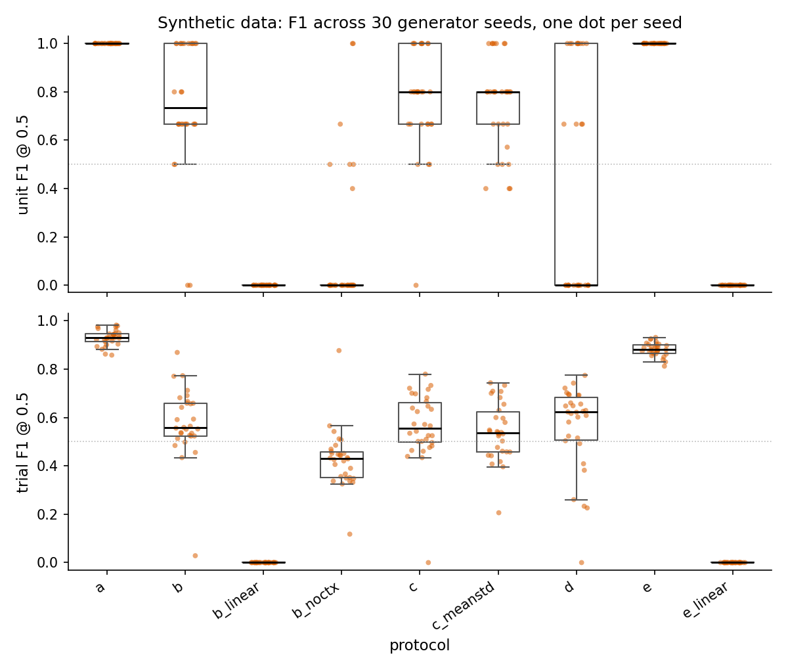
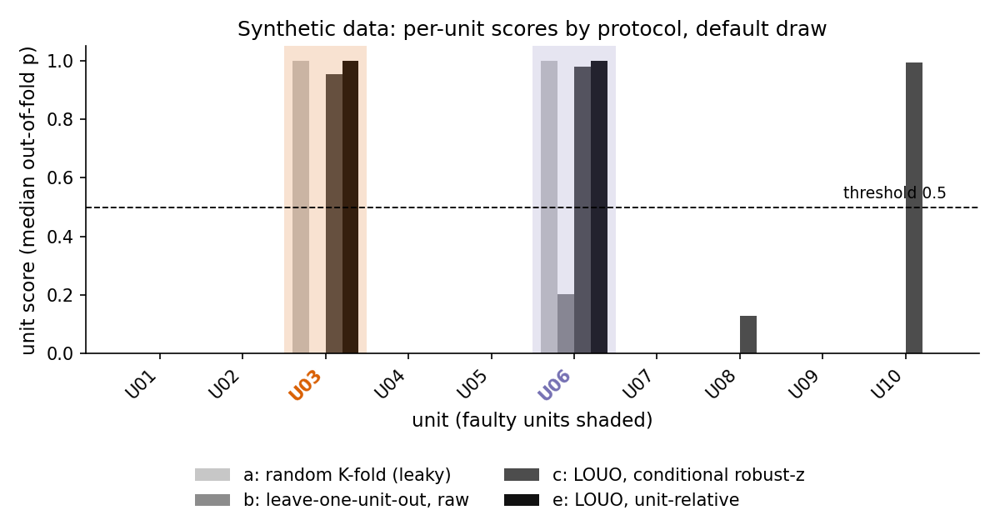
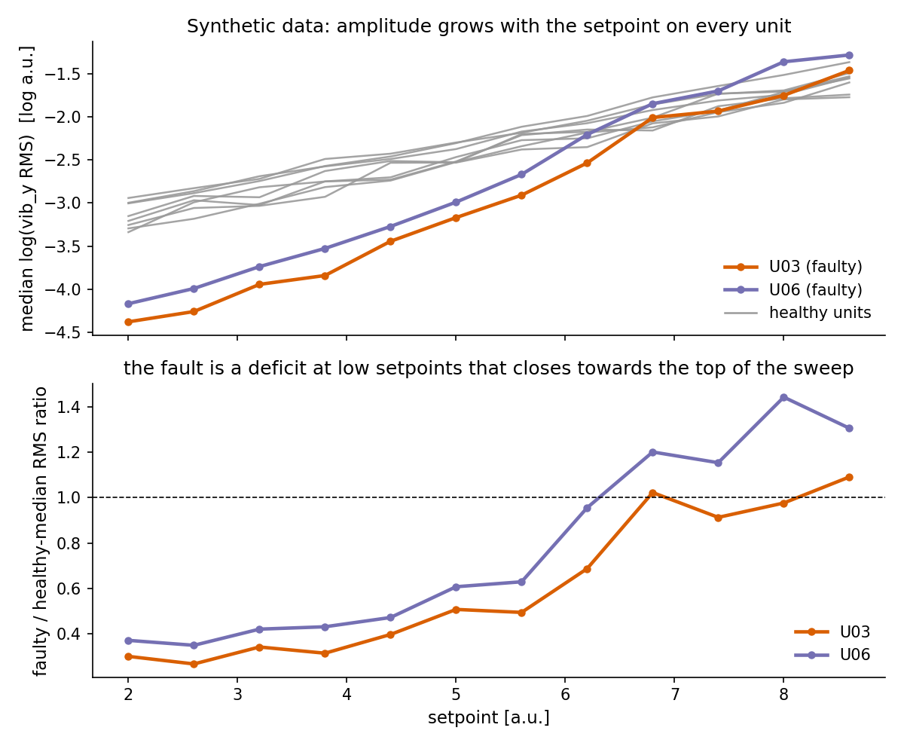

（英語版 README.md が正本。数値・表はそこから転記）

# vibration-anomaly-lab

[](https://github.com/hocky0301/vibration-anomaly-lab/actions/workflows/ci.yml)

**独立性の単位は行ではなく機械である。** 産業設備の状態監視では、1台の機械が
数千行のデータを生み、健全性ラベルは機械に属する。したがって行やトライアル単位の
ランダム分割は同じ機械をフォールドの両側に置き、モデルはその機械を見分けるだけで
済んでしまう。本リポジトリはこの失敗を完全合成データ上で測定可能にする。生成器が
個体ごとの指紋を持つ10台の機械（うち2台が故障）を書き出し、独立したスクリプトが
そのデータ上で名前付きの9つの評価プロトコルを再学習し、シードスイープが全体を
30回の独立な抽選で繰り返す。そのうえで、定番の対策である運転点条件付き標準化が
どこで効かなくなるかを測定する。

[English](README.md) · [再現手順](docs/05-reproduction.md) · [評価の限界](docs/03-small-sample-honesty.md) · [Validation record](docs/06-validation-record.md)

以下はすべて合成データである。評価値は `results/`、生成条件と図の診断値は生成器と
`scripts/make_figures.py` に由来する。これは教材であり、配備可能な検知器ではない。
この生成器では機械単位で分割する。実機では製造バッチ・拠点・時期・校正の共有も考慮する。

## 最初に動かす

Python 3.11 と固定した再現環境を使う。`make verify-reference` は保存済みの結果を上書きせず、
個体別スコアを含む全フィールドを新しい計算結果と照合する。

```bash
python3.11 -m venv .venv
source .venv/bin/activate
python -m pip install -r requirements-repro.txt
make data
make verify-reference
make test
```

デフォルトの抽選と複数抽選の表を合わせて読む。詳しくは[再現手順](docs/05-reproduction.md)。

## 何を測定するか

`verify_claims.py` は9つのプロトコルを学習する。各プロトコルは（分割、特徴空間、
モデル）の三つ組である。トライアル特徴量は21個の振幅統計量（3軸それぞれの rms, std,
mad, iqr, p90, absmean, ptp）に、明記した場合は運転点を加えたものである。
GBM = `HistGradientBoostingClassifier(max_iter=300)`、linear = 標準化した
ロジスティック回帰、`C=0.005`。

| id | 分割 | 特徴空間 | モデル |
|---|---|---|---|
| a | トライアル単位の StratifiedKFold(5) **[リークあり]** | 生統計量 + setpoint + speed_rpm | GBM |
| b | 1個体抜き交差検証（leave-one-unit-out） | 生統計量 + setpoint + speed_rpm | GBM |
| b_linear | 1個体抜き交差検証（leave-one-unit-out） | 生統計量 + setpoint + speed_rpm | linear |
| b_noctx | 1個体抜き交差検証（leave-one-unit-out） | 生統計量のみ（運転点なし） | GBM |
| c | 1個体抜き交差検証（leave-one-unit-out） | 運転点条件付きロバストz（median/MAD） + setpoint | GBM |
| c_meanstd | 1個体抜き交差検証（leave-one-unit-out） | 条件付きz（mean/std） + setpoint | GBM |
| d | 1個体抜き交差検証（leave-one-unit-out） | 運転点条件付きロバストz（median/MAD） + setpoint | linear |
| e | 1個体抜き交差検証（leave-one-unit-out） | 個体相対の対数統計量 + setpoint（トランスダクティブ） | GBM |
| e_linear | 1個体抜き交差検証（leave-one-unit-out） | 個体相対の対数統計量 + setpoint（トランスダクティブ） | linear |

c / c_meanstd / d では、各フォールドの参照分布は学習フォールド内の健全ラベル付き
トライアルから構築し、ホールドアウトした個体からは決して構築しない。プロトコル e は
各個体自身の対数統計量の中央値を引く（ラベル不要だが、その個体の掃引全体を必要と
する）。判定は固定しきい値 0.5 で行い、個体スコアはその個体のフォールド外トライアル
確率の中央値である。

### 30シード

生成器の30回の独立な抽選（シード 0-29）。故障の配置は10個体のなかから一様ランダム、
定数の調整は一切なし。[`results/seed_sweep.md`](results/seed_sweep.md) から転記：

| protocol | split / space / model | mean trial F1@0.5 | mean unit F1@0.5 | seeds with unit F1@0.5 = 1.0 | mean unit AUC | mean unit F1 lowhalf@0.5 |
|---|---|---|---|---|---|---|
| a | StratifiedKFold(5) over trials / raw stats + setpoint + speed_rpm / HistGradientBoosting | 0.930 | 1.000 | 30/30 (1.00) | 1.000 | 1.000 |
| b | leave-one-unit-out / raw stats + setpoint + speed_rpm / HistGradientBoosting | 0.578 | 0.758 | 12/30 (0.40) | 0.950 | 0.967 |
| b_linear | leave-one-unit-out / raw stats + setpoint + speed_rpm / logistic regression | 0.000 | 0.000 | 0/30 (0.00) | 0.148 | 0.000 |
| b_noctx | leave-one-unit-out / raw stats only / HistGradientBoosting | 0.427 | 0.152 | 2/30 (0.07) | 0.688 | 0.809 |
| c | leave-one-unit-out / conditional robust-z (median/MAD) + setpoint / HistGradientBoosting | 0.562 | 0.772 | 9/30 (0.30) | 0.923 | 0.869 |
| c_meanstd | leave-one-unit-out / conditional z (mean/std) + setpoint / HistGradientBoosting | 0.543 | 0.751 | 7/30 (0.23) | 0.940 | 0.824 |
| d | leave-one-unit-out / conditional robust-z (median/MAD) + setpoint / logistic regression | 0.559 | 0.422 | 10/30 (0.33) | 0.923 | 0.877 |
| e | leave-one-unit-out / unit-relative log stats + setpoint / HistGradientBoosting | 0.882 | 1.000 | 30/30 (1.00) | 1.000 | 1.000 |
| e_linear | leave-one-unit-out / unit-relative log stats + setpoint / logistic regression | 0.000 | 0.000 | 0/30 (0.00) | 0.000 | 0.000 |

`lowhalf`：個体スコアを、掃引の低運転点側の半分（設定値が中央値以下）のトライアルに
わたる中央値としたもの。生成器が故障を置く領域である。30シードにわたる個体識別可能性：
平均 0.859 / 最小 0.688 / 最大 0.957（チャンスレベル 0.100）。ペアワイズ比較、
個体 AUC による b 対 c：勝ち/引き分け/負け = 4/18/8（勝ち = そのシードで c が b を
厳密に上回る）。



*図05。1シード1点：a と e はすべてのシードで 1.000、b / c は個体レベルで
0.000 から 1.000、c_meanstd は 0.400 から 1.000 まで散らばり、d は二峰性。*

### デフォルトの抽選を例として

デフォルトシード（2026）での `make verify`：10個体、720トライアル、故障個体は
U03 と U06。[`results/default_draw.json`](results/default_draw.json) から転記。
`best (t)` は37個のしきい値にわたる個体 F1 の最大値で、評価に使うラベルそのもので
選んでいるため、構造的に楽観的である。

| id | trial F1@0.5 | unit F1@0.5 | unit AUC | unit F1 lowhalf@0.5 | best (t) |
|---|---|---|---|---|---|
| a | 0.908 | 1.000 | 1.000 | 1.000 | 1.000 (0.05) |
| b | 0.455 | 0.000 | 1.000 | 1.000 | 0.667 (0.05) |
| b_linear | 0.000 | 0.000 | 0.000 | 0.000 | 0.333 (0.05) |
| b_noctx | 0.337 | 0.000 | 0.000 | 1.000 | 0.000 (0.05) |
| c | 0.424 | 0.800 | 0.875 | 0.800 | 0.800 (0.15) |
| c_meanstd | 0.395 | 0.500 | 0.875 | 0.800 | 0.800 (0.15) |
| d | 0.286 | 0.000 | 0.938 | 0.667 | 0.667 (0.28) |
| e | 0.852 | 1.000 | 1.000 | 1.000 | 1.000 (0.05) |
| e_linear | 0.000 | 0.000 | 0.000 | 0.000 | 0.333 (0.05) |

同じ抽選での個体ごとのフォールド外中央値スコア（truth 1 = 故障）：

| unit | truth | a | b | c | e |
|---|---|---|---|---|---|
| U01 | 0 | 0.000 | 0.000 | 0.000 | 0.000 |
| U02 | 0 | 0.000 | 0.000 | 0.000 | 0.000 |
| U03 | 1 | 1.000 | 0.000 | 0.955 | 1.000 |
| U04 | 0 | 0.000 | 0.000 | 0.000 | 0.000 |
| U05 | 0 | 0.000 | 0.000 | 0.000 | 0.000 |
| U06 | 1 | 1.000 | 0.204 | 0.978 | 0.999 |
| U07 | 0 | 0.000 | 0.000 | 0.000 | 0.000 |
| U08 | 0 | 0.000 | 0.000 | 0.130 | 0.000 |
| U09 | 0 | 0.000 | 0.000 | 0.000 | 0.000 |
| U10 | 0 | 0.000 | 0.000 | 0.995 | 0.000 |

この抽選での個体識別可能性：GBM が生のトライアル特徴量から `unit_id` を5分割
交差検証精度 0.904（チャンスレベル 0.100）で予測する。これがリークである。



*図04。プロトコル b は故障2個体を上位2位に並べる（個体 AUC 1.000）が、どちらも 0.5 を
超えない。プロトコル c は両方で 0.5 を超えるが、健全な U10 でも超える。*

## 読み方

1. **リークは脆くない。** プロトコル a は30シード中30で個体 F1 1.000 に達し、
   トライアル F1 は平均 0.930。同じモデルを1個体抜き交差検証（leave-one-unit-out）
   にかけると（b）、平均 0.758、1.000 に達するのは12シードである。この機構は
   モデルなしでも見える。分類器は21個の生統計量に `setpoint` と `speed_rpm` を加えた
   特徴量から `unit_id` を平均精度 0.859
   （デフォルトの抽選では 0.904）で復元する。チャンスレベルは 0.100 である。
   図03がその理由を示す。ある1つの運転点において、個体は振幅でも速度応答でも
   別々の水準に位置する。ラベルは個体内で一定なので、個体を見分けることは
   ラベルを知ることと同じである。
   [`docs/01`](docs/01-why-random-cv-lies.md)。

2. **粒度が話を変える。** デフォルトの抽選での行 b：トライアル F1 0.455、個体 F1
   0.000、個体 AUC 1.000、低運転点側半分の個体 F1 1.000。4つとも同じフォールド外
   確率から出ている。トライアルレベルの数値はモデルが凡庸だと言い、個体レベルの
   F1 は何も検出しないと言い、個体 AUC は故障2個体をすべての健全個体より上に
   並べると言い、低運転点側半分の F1 は故障のある場所でスコアを取れば固定しきい値
   が機能すると言う。判断が下される粒度で報告し、どの集約がそれを生んだかを明記
   すること。

3. **運転点が振幅を支配する。** 生の特徴空間から運転点の2列を除くと（b_noctx）、
   30シード平均の個体 AUC は 0.950 から 0.688 に、平均個体 F1 は 0.758 から 0.152
   に落ちる。図02がその理由を示す。健全個体の振幅は掃引を通じて、ほとんどの
   運転点における健全と故障の差よりも大きく成長するため、運転点を伴わない絶対
   振幅はおおむね運転点を測っているに過ぎない。残るのは掃引の底で、そこでは故障
   個体はどの健全個体よりも静かである。b_noctx でも低運転点側半分の平均個体 F1 は
   0.809 に達する。

4. **今回の条件付き特徴空間は、検証した線形パイプラインを改善する。** 線形モデルでは、生特徴量の個体 AUC
   は 0.148（b_linear）、運転点条件付きロバストzでは 0.923（d）となる。変換が
   用いた線形パイプラインの順位指標を改善している。GBM の比較は一方向ではない。個体 AUC による c 対 b は30シードで 4 勝 18 分 8 敗、平均は 0.923
   （c）対 0.950（b）である。この結果から c の一般的な優位性は示せない。さらに c は `speed_rpm` を
   落としており、条件付けだけの効果を分離した比較ではない。 図04がデフォルトの抽選での代償を示す。c は故障個体を 0.5 の上に
   持ち上げるが、健全な U10 も 0.995 に持ち上げる。
   [`docs/02`](docs/02-conditioning-not-models.md)。

5. **故障がどこにあるかが集約を決め、個体相対の正規化がここでの頑健な対策である
   —— ただし代償を伴う。** 故障は低運転点側の半分に集中している（生成器の折れ点は
   掃引位置 0.55、12個の設定値のうち7番目のすぐ上にあり、遷移幅は 0.22）ため、
   掃引全体の中央値として取った個体スコアはそれを希釈する。線形モデル d は平均個体 F1
   0.422（掃引全体）から 0.877（低運転点側半分）に変わる。プロトコル e は各個体を
   自身の対数水準の中央値で正規化し、setpoint を残す。その空間上の GBM は30シード
   中30で個体 F1 1.000 に達し、平均トライアル F1 は 0.882 である一方、同じ空間上の
   線形モデルはすべてのシードで 0.000 となる（e_linear）。正規化を生き残るのは掃引
   の*形状*、すなわち setpoint との交互作用である。代償は、e がトランスダクティブ
   （推論時にその個体の掃引全体が必要）であることだ。新しい個体のどのトライアルも、
   その個体の掃引全体が揃うまでスコア付けできない。

6. **1抽選あたり陽性2個体では指標が粗い。** 抽選ごとの故障個体が2つでは、個体 AUC は
   ごく少数の値しか取らず、c 対 b は30シード中18で引き分けに終わる。0.5 での個体
   F1 は15通りの値しか取り得ない（[`docs/03`](docs/03-small-sample-honesty.md)）。反復抽選からこの生成器内の差を調べることはできるが、
   実機での優位性は示せない。図05の散らばりはデプロイ時の誤差の推定ではない。
   [`docs/03`](docs/03-small-sample-honesty.md)。

## 正直さに関する注記

- 判定しきい値は `best (t)` 列を除いて全箇所で 0.5 に固定している。`best (t)` 列は
  評価対象のラベルで選んだ37個のしきい値にわたる最大値であり、構造的に楽観的で
  ある。固定しきい値と楽観的なグリッド探索を比較するための値であり、
  あらゆるしきい値に対する上限ではない。
- 抽選ごとの故障個体は n = 2。個体レベルのすべての数値は、この生成器に関する存在
  証明である。30シードは、同じシミュレータの再抽選のもとで順序が保たれるかを示す
  ものであり、実機にわたる分散を推定するものではない。
- すべてのデータは合成であり、`data/make_synthetic_data.py` が生成する。
- 個体 AUC は、別々の個体抜きモデルが出した確率を合わせた記述的指標である。
  フォールド間の確率尺度や学習側のクラス比率の違いにも影響され、単一の学習済み
  モデルを独立テストで測った AUC とは異なる。
- `production_model.py` は教材用 API である。モデルとしきい値は同じ OOF ラベルで
  選ぶため、完全に分離できる場合も選択の楽観性が残る。仮の判定とレビュー要求を返すため、利用側がその要求を尊重する必要がある。
  レビュー要求は配備の性能や安全性の保証ではない。
- Median/MAD と mean/std は一部の抽選で判定が異なる。示した指標全体で
  一貫した優位性が確立したわけではない。
  平均個体 F1 は 0.772（c）対 0.751（c_meanstd）、平均個体 AUC は 0.923 対 0.940、
  個体 AUC は30シード中23で同点。トライアル内のロバスト振幅特徴量のほうが変動は小さい
  —— 健全な（個体, 運転点）セル内の `vib_y_mad` のトライアル間変動係数は 0.054
  で、`vib_y_rms` と `vib_y_std` の 0.145、`vib_y_ptp` の 0.387 に対して小さい
  （図06）。これは入力特徴量の変動であり、個体間で推定する条件付けの
  分母の不確実性を測ったものではない。
- `unit F1 lowhalf@0.5` 列は、生成器による故障の定義から宣言した領域で集約している。
  これはモデリング上の仮定であって、ラベルなしの発見ではない。実際のデプロイでは、
  スコアリングの前にドメイン知識から領域を宣言しなければならず、さもなければ領域は
  ラベルに合わせて決めたもう一つのしきい値になる。
- 生成器はこれらの数値のいずれに向けても調整していない。数値が期待外れであっても、
  そのまま報告している。

## 追加のコマンド

冒頭で作成した環境を有効にして実行する。

```bash
make verify           # 再計算 -> .work/default_draw.json
make verify-reference # 再計算し、保存済みJSONの全フィールドと照合
make sweep            # 生成器の反復 -> .work/sweep/
make model-seeds      # データ固定でモデルseedを反復 -> .work/model-seeds/
make figures          # data/ と results/ から図を再生成
make demo             # 教材用のモデルと指標設計のデモ
make check            # 公開ツリーの点検
```

`make data SEED=7` は別の合成母集団を抽選する。保存済みの基準値との照合には
デフォルトseedを使い、別の抽選の結果を見る場合は `make verify` を使う。
`make sweep SEEDS=5 JOBS=2` は短縮版である。実行時間はマシンと依存関係に左右される。
過剰な並列化を避けるため、OpenMPとBLASのスレッド数には上限を設けている。

## 生成器が埋め込んでいるもの

`data/make_synthetic_data.py` は試験ベンチを模擬する。各**個体**（機械）は12個の
設定値（2.0 から 8.6）からなる上昇**掃引**を6回走らせ、各滞留区間が384個の3軸
サンプルからなる1つの**トライアル**である。デフォルト：ラベル付き10個体、うち2個体が
故障。ホールドアウトは互いに素な5個体、うち1個体が故障。シード 2026。4つの性質が
コードに書き込まれており、ドキュメントはそれらが生むものを報告する。

1. **運転点が振幅を支配する。** 対数振幅は掃引位置に対して、軸ごとの指数
   1.45 / 1.60 / 1.80 で線形に増加する。すなわち健全個体の振幅は掃引を通じて
   おおよそ exp(1.45) から exp(1.80) 倍になる。デフォルトの抽選では、設定値 8.6
   での健全個体の平均 `vib_y_rms` は 2.0 での値の 4.84 倍である（`vib_z_rms` は
   5.66 倍）。
2. **個体には指紋がある。** 各個体は水準オフセット、軸ごとのオフセットと傾き、
   速度ゲインとドループ、ノイズフロア、高調波の重み、バーストゲインを抽選し、
   それらは個体の生涯にわたって固定される。これがリークの源である。
3. **健全な挙動は裾が重い。** Student-t ノイズ（自由度 2.4）と、4分の1のトライアル
   におけるインパルス状のバーストがあり、いずれも局所振幅でスケールされる。
   外れ値に敏感な統計量（std, ptp）は、デフォルトの抽選ではロバストな統計量
   （mad, iqr, p90）よりトライアル間の変動が大きい（図06）。
4. **故障は低運転点側半分に集中した片側の欠損である。** 故障個体の対数振幅は、
   掃引の底ではほぼ全量、頂上ではほぼゼロまで減衰する項と、小さな定数によって
   減らされる。解析的には、抽選される範囲の中央にある y 軸で、故障/健全比は底で
   約 0.32、頂上で約 1.08 である。デフォルトの抽選で測定した `vib_y_rms` の中央値比
   は設定値 2.0 で 0.30（U03）と 0.37（U06）、8.6 で 1.09 と 1.31 である（図02）。
   したがって故障個体の掃引平均の*対数*水準（幾何平均振幅）は健全より*低い*のであって、
   等しいのではない。掃引全体の `vib_y_rms` の算術平均では差は小さい（デフォルトの
   抽選で、健全個体の掃引平均に対して U03 が 0.78、U06 が 0.96）。

どの個体が故障かは、指紋の抽選後に一様ランダムに抽選する。故障項は統計的な形状の
ために選んだもので、物理的機構から導いたものではない。加振力が回転速度の2乗に
比例するという仮定だけでは、構造の応答や健全側の基準を置かずに、観測振幅や
異常/正常の比がどうなるかを決めることはできない。



*図02。故障個体は低運転点では健全帯域をはるかに下回り、頂上ではそれと同等かそれ以上
となる。比率パネルが故障の形状である。*

## リポジトリ構成

```
vibration-anomaly-lab/
├── README.md, README.ja.md         this file and its Japanese version
├── LICENSE                         MIT
├── Makefile                        setup, setup-dev, data, verify, sweep, figures, test, demo, check, clean, all
├── CHANGELOG.md
├── pyproject.toml                  package metadata (pip install -e .)
├── requirements.txt                numpy, pandas, scikit-learn
├── requirements-dev.txt            + pytest, matplotlib, ruff
├── verify_claims.py                the nine protocols; standalone, imports nothing from the package
├── data/
│   ├── README.md                   schema, provenance, the shape of the fault
│   ├── make_synthetic_data.py      the generator
│   └── synthetic/                  train.csv, holdout.csv, holdout_labels.csv (generated, git-ignored)
├── vibration_anomaly_lab/          the same ideas as an importable package
│   ├── features.py                 trial-level featurisation (parity-tested against verify_claims.py)
│   ├── conditioning.py             ConditionalRobustZ with a fit / transform split
│   ├── validation.py               leave-one-unit-out, unit-level scoring
│   ├── production_model.py         a panel model that flags every unit for review when no member separates
│   └── metric_design.py            how many bits a returned score leaks about hidden group labels
├── scripts/
│   ├── sweep_seeds.py              verify_claims on many generator seeds -> results/
│   ├── make_figures.py             figures/*.png from data/ and results/
│   └── check_public.sh             anonymisation and tracked-file gate
├── results/
│   ├── default_draw.json           make verify on the default seed
│   ├── seed_sweep.json             30 per-seed documents
│   ├── seed_sweep.md               the 30-seed table quoted above
│   └── seed_sweep_per_seed.md      one row per seed
├── figures/                        01 sweep structure, 02 amplitude vs setpoint, 03 fingerprints,
│                                   04 protocol unit scores, 05 seed sweep, 06 robust scale, 07 leakage
├── docs/
│   ├── 01-why-random-cv-lies.md            anatomy of the leak on this data
│   ├── 02-conditioning-not-models.md       conditioning comparisons and confounds
│   ├── 03-small-sample-honesty.md          what n = 2 can and cannot say
│   └── 04-metric-design-and-disclosure.md  the returned score as an information channel
├── tests/                          generator, conditioning, validation, production model, metric design,
│                                   verify CLI, package/script parity, public hygiene
└── .github/workflows/ci.yml        tests, demos, verify, hygiene, drift check against committed results
```

`verify_claims.py` は `vibration_anomaly_lab/` から何もインポートしないので、壊れた
モジュールが検証をトートロジーに変えることはできない。`tests/test_parity.py` は
パッケージの特徴量化と条件付けがそれと一致することを検査する。ホールドアウトファイル
は、どのフォールドにも入らなかった機械でパイプラインを1回だけ採点できるように存在
する。5個体・故障1つでは形式チェックであって評価ではない。

## これは何ではないか

- **実データではない。** すべてのサンプルは `data/make_synthetic_data.py` に由来する。
  ここにあるものは、いかなる機械・製品・フリートの測定値でもない。
- **実機の性能推定ではない。** 1抽選あたり陽性2個体を含む、特定の生成器上での
  記述的な性能測定であり、実機での検知性能を推定したものではない。
- **条件付け単独の除去実験ではない。** 比較する特徴空間は速度列の有無も異なる。
  c 対 b の AUC は4勝18分8敗だが、変換だけの因果効果を分離した結果ではない。
- **校正された物理モデルではない。** 故障の形は指定したもので、検証済みの物理的
  故障機構から導いたものではない。
- **`best (t)` はしきい値選択に楽観性がある。** 評価対象ラベル上で有限の候補から
  最大値を選ぶ。他の列は固定しきい値0.5である。
- **スペクトルを使った欠陥診断の検証ではない。** 生成器には高調波・ノイズ・バースト
  が含まれるが、検証済みの軸受・歯車の欠陥物理はない。公開した特徴量抽出は振幅統計量を
  用いる。実機でのスペクトル特徴の有用性は、故障機構・帯域・計測系に依存する。
- **グループ単位の交差検証で十分だという主張ではない。** 1個体抜き交差検証
  （leave-one-unit-out）はここでモデル化したリークを修正する。時間順序、共有された
  校正イベント、バッチ効果、未来の情報から導かれたラベル定義はモデル化していない。

## ライセンス

MIT。[`LICENSE`](LICENSE) を参照。
