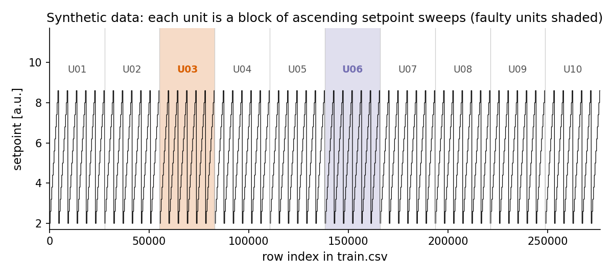
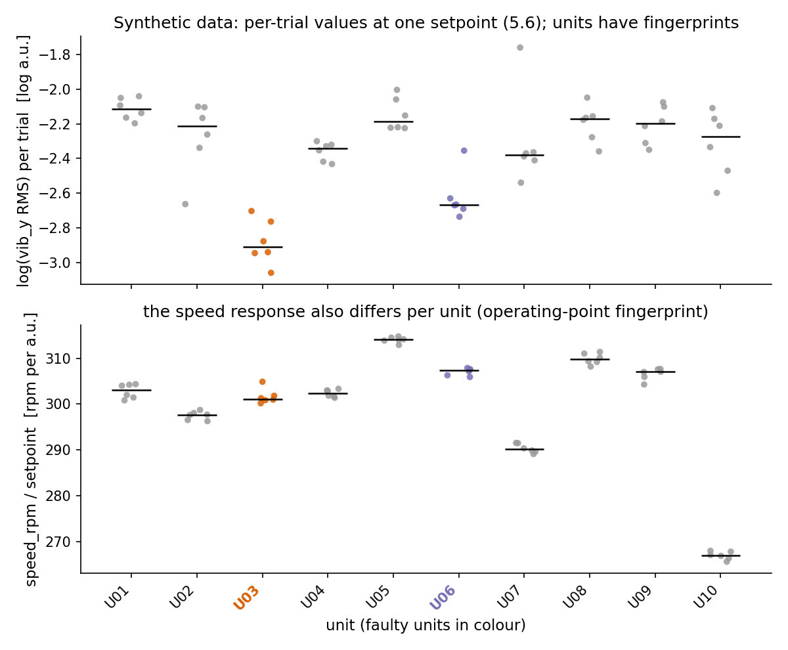

# Why Random Cross-Validation Lies

*An anatomy of group leakage on this data: how identifiable the machines are,
what a random split over trials measures instead of the fault, and why the
grain of the reported number decides what it means.*

All numbers come from `results/default_draw.json` (the default seed) and
`results/seed_sweep.md` (30 seeds), both written by `verify_claims.py` on data
from `data/make_synthetic_data.py`. Everything is synthetic.

## The shape of the data

The generator simulates a test bench. A **unit** is a machine. A **trial** is
one short stationary block of triaxial vibration recorded while the bench
dwells at one commanded setpoint. A **sweep** steps the setpoint through 12
levels and each unit runs 6 sweeps, so a unit contributes 72 trials of 384
samples each. The labelled set has 10 units and 720 trials; two units are
faulty (U03 and U06 on the default seed; a pair drawn uniformly at random on each
seed, which can repeat across seeds).

The health label is a property of the machine, so all 72 trials of a faulty
unit carry `label = 1`. For a target of unseen machines, random trial splitting creates the problem:

> If a unit has labelled trials in training, recognising that same unit in
> validation can recover its already observed label. This does not establish
> independence between machines or performance on an unseen unit.

*Figure 01. `train.csv` is ten blocks of six ascending sweeps; the two shaded
blocks are the faulty units. A random split over rows or trials draws from
every block.*

## How identifiable is a machine?

`verify_claims.py` measures this directly, without any health label: a
`HistGradientBoostingClassifier` is asked to predict `unit_id` from the 21 raw
trial statistics plus the operating point, under 5-fold cross-validation over
trials. On the default draw it succeeds with accuracy 0.904; across the 30
seeds of the sweep the accuracy is 0.859 on average, never below 0.688 and up
to 0.957. Chance is 0.100.

*Figure 03. At a single setpoint (5.6), each unit's trials sit on their own
level in `log(vib_y_rms)` and in `speed_rpm / setpoint`. Those levels are the
fingerprint.*

The generator produces the fingerprint on purpose, as a stylised model of effects that can occur in machinery: each unit draws its own level offset, per-axis offsets and sweep
slopes, a speed gain and a load droop, a noise floor, harmonic weights and a
burst gain, all fixed for its lifetime. These terms can stand in for mounting, alignment and sensor-placement
effects; the simulation does not identify or validate those physical causes. The consequence is that an absolute
feature vector is close to a name tag.

## Two protocols, two answers

Same features, same model, same unit-level decision rule (median of the
out-of-fold trial probabilities, threshold 0.5). Only the splitter changes.

| protocol | split | unit F1@0.5, default draw | mean unit F1@0.5, 30 seeds | seeds at 1.000 |
|---|---|---|---|---|
| a | StratifiedKFold(5) over trials **[leaky]** | 1.000 | 1.000 | 30/30 |
| b | leave-one-unit-out | 0.000 | 0.758 | 12/30 |

Protocol a is perfect on every one of 30 draws. Protocol b -- the same
gradient-boosted tree asked about a machine it has never seen -- averages
0.758, reaches 1.000 on 12 draws and 0.000 on some (Figure 05 in the README
shows the per-seed dots). At the trial level the gap is 0.930 against 0.578.
The two protocols do not disagree about the size of an effect; on the default
draw they disagree about whether the model works at all.

The mechanism: random 5-fold over 720 trials puts roughly 58 of each unit's 72
trials in the training fold. For every validation trial the model has already
seen dozens of trials from the same machine, each stamped with the answer. It
does not learn "faulty"; it learns "this looks like U03", and U03 is labelled
faulty. Under leave-one-unit-out the held-out machine's fingerprint was never
in training and the strategy has nothing to match.

The important property is that **the leak is invisible in the metric.** No
warning, no NaN, no suspicious feature importance. Every component did what it
was asked. The failure is in the question the protocol asked.

## The grain of the number

Protocol b on the default draw, read four ways from the same out-of-fold
probabilities (`results/default_draw.json`):

| quantity | value | what it says |
|---|---|---|
| trial F1@0.5 | 0.455 | a mediocre trial classifier |
| unit F1@0.5 | 0.000 | no faulty machine crosses 0.5 (U03 scores 0.000, U06 0.204) |
| unit AUC | 1.000 | both faulty machines are ranked above every healthy one |
| unit F1 lowhalf@0.5 | 1.000 | the median over the low-setpoint half crosses 0.5 on both |

None of these is wrong. They answer different questions. The trial-level
number treats 72 correlated trials as 72 verdicts and flatters or punishes the
model according to how the fault is spread across the sweep; the unit-level
F1 at a fixed threshold reports the decision that would actually be taken; the
unit AUC reports the ranking without a threshold; the low-half F1 reports the
decision once the score is taken where the fault lives (the generator puts it
in the low-setpoint half; see `data/README.md`). The number to report is the
one at the grain of the decision, with the aggregation named. Here that is a
unit-level number, and the README reports all four columns so that the reader
can see which one is doing the work.

## Finding the unit of independence

Start with the deployment question: new trials on a known machine, a new
machine, or a new site can require different splits. Then inspect the sampling
hierarchy: sample, trial, sweep, machine, batch, site and measurement campaign.
Use acquisition records to identify dependencies that will not be shared with
the intended future test case. Preserve temporal ordering when it is relevant.

A constant label within a group is an integrity check and can enable a known-ID
lookup if that group appears on both sides of a split. It is not proof of
independence, and mixed labels do not rule out within-group dependence. Do not
choose a grouping level merely because every group at that level has one label.

Two useful diagnostics, neither conclusive on its own:

- **Predict the group ID.** Recoverable identity shows a signature that could
  support memorisation when labelled groups cross the split. It does not prove
  that a health classifier relies exclusively on that signature.
- **Compare the intended group split with a random trial split.** A large gap
  motivates investigation of dependence and distribution shift. It is not, by
  itself, a unique diagnosis of why the scores differ.

The generator supplies known machine IDs and deliberately shared within-machine
fingerprints. That controlled construction lets the experiment demonstrate the
failure mode; real acquisition processes need their own dependency audit.

## What leave-one-group-out buys, and what it does not

Leave-one-group-out (LOGO; here leave-one-unit-out, one fold per machine) is
an evaluation of held-out groups under this design, not a performance floor
or a guarantee of unbiased deployment estimates.

- **The population is fixed and tiny.** LOGO resamples which of 10 units is
  held out, but every fold draws from the same 10 machines. Variation across
  manufacturing batches, sensor generations or maintenance histories is not in
  the simulator, so LOGO cannot measure it.
- **The folds are not independent.** The training sets overlap across folds;
  predictions can therefore be dependent. The spread across fold scores is not
  an estimator of population sampling uncertainty.
- **Only the group variable is held out.** The acquisition chain, the setpoint
  grid and the feature definitions stay shared across folds. LOGO controls the
  leak you named, not the ones you did not.
- **The positive class is two machines.** Every fold that holds out a faulty
  unit trains on one remaining positive. See `03-small-sample-honesty.md`.

LOGO does not say the model will generalise. It says that one specific,
common and destructive way of fooling yourself has been ruled out.

## The takeaway

The 1.000 in row a is not a bug in scikit-learn, the features or the model.
The protocol asked "can you recognise machines you have already met?" and the
answer was yes. Choosing the split is choosing the estimand; choosing the
grain of the reported number is choosing the question. Do both before choosing
the model.
