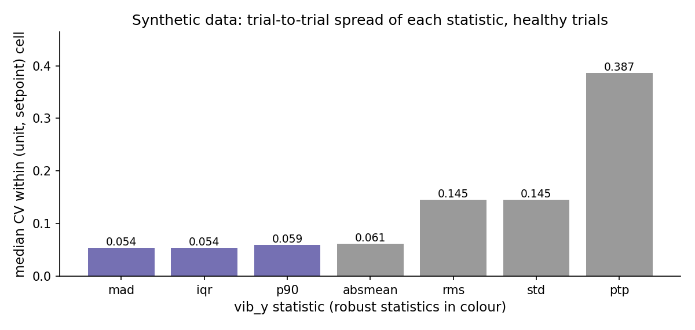

# Operating-Point Conditioning: What the Comparisons Establish

All results below are synthetic and come from `results/seed_sweep.md` and
`results/default_draw.json`. The generator and the published protocols are fixed.

## The observation

| protocol | feature space | model | mean pooled unit AUC | mean unit F1@0.5 |
|---|---|---|---|---|
| b_linear | raw stats + setpoint + speed_rpm | logistic regression | 0.148 | 0.000 |
| d | conditional robust-z + setpoint | logistic regression | 0.923 | 0.422 |
| b | raw stats + setpoint + speed_rpm | HistGradientBoosting | 0.950 | 0.758 |
| c | conditional robust-z + setpoint | HistGradientBoosting | 0.923 | 0.772 |

Across the 30 generator seeds, c has a higher unit AUC than b on 4 draws,
ties on 18 and is lower on 8. Mean unit F1 and mean unit AUC point in different
directions. This does not establish a consistent advantage for c.

The tested linear pipeline improves its ranking when given the conditioned
representation. That is an observation about this pipeline, regularisation,
feature space and simulator. AUC alone does not prove linear separability.

## The comparison is not a pure conditioning ablation

Protocol b includes `speed_rpm`; c does not. The linear pair has the same
asymmetry. Thus each contrast changes both the transformation and the feature
set. A matched comparison would keep the context columns fixed and vary only
the transformation, using paired generator seeds and a declared comparison
rule. That experiment has not been performed in this release.

A tree can split on the operating point and then on amplitude, which is a
plausible reason raw features already work well. This is an interpretation,
not an identified mechanism. Conditioning also uses a healthy reference fitted
with training labels; describing it as simply adding no information obscures
that supervision. Neither the current comparison nor a future simulator
experiment can establish the cause of a result on unavailable real data.

Unit AUC pools outputs of different leave-one-unit-out models. Their probability
scales and training class balance can differ. Treat this AUC as a descriptive
summary of the pooled predictions, not the ranking performance of a single
fitted detector on an independent test set.

## Robust input statistics and robust references are different objects

Within healthy (unit, setpoint) cells on the default draw, the median
trial-to-trial coefficient of variation is 0.054 for `vib_y_mad` and
`vib_y_iqr`, 0.059 for `vib_y_p90`, 0.145 for `vib_y_rms` and `vib_y_std`,
and 0.387 for `vib_y_ptp` (computed by `scripts/make_figures.py`).



These are input features computed inside a trial. They are not repeated
estimates of the cross-unit denominator used in conditional standardisation.
The figure therefore cannot establish that the fitted MAD reference has lower
estimation uncertainty than the fitted standard-deviation reference.

Replacing the conditional median/MAD reference by mean/std changes some
predictions. The mean unit F1 values are 0.772 and 0.751; the mean unit AUC
values are 0.923 and 0.940. AUC ties on 23 of the 30 draws. This is not
identical behaviour or an equivalence test, and neither reference wins on
every reported metric. Contaminated-reference robustness is a separate,
unmeasured question; this experiment does not deliberately mislabel a healthy
reference unit.

## Fit the reference inside the fold

The reference is restricted to training-fold trials labelled healthy:

```python
ref = np.zeros(len(F), dtype=bool)
ref[tr] = y[tr] == 0
X = conditional_robust_z(F, feats, ref, scale="mad")
```

The package expresses the same separation using `fit` and `transform`:

```python
ref = ConditionalRobustZ(feats).fit(healthy_reference(F, train_idx))
Z_train = ref.transform(F.iloc[train_idx])
Z_valid = ref.transform(F.iloc[valid_idx])
```

Computing a healthy reference before splitting can use held-out health labels
and measurements. That violates the stated protocol even when the held-out
faulty unit would be excluded by its label. Missing reference bins fall back
to training-reference global statistics, and z-scores are clipped to ±8.

Any scaler, imputer, feature selector or reference estimator fitted from data
belongs inside the training fold. Group splitting does not protect work that
was fitted before the split.

## Whole-unit normalisation changes the information available at prediction time

Protocol e subtracts each unit's own median log amplitude. It uses no labels
but requires all the trials in that unit's evaluation batch, including those
being scored. This is an explicit transductive protocol. It is not access to
a previously recorded healthy baseline, nor a streaming detector.

The tested tree on e reaches unit F1@0.5 of 1.000 on all 30 draws; the tested
linear model on the same representation has unit F1@0.5 of 0.000. These are
facts about this simulator and the chosen models, not proof that the feature
space contains no linear information or that a tree is universally required.

## Sources of numbers

- Protocol averages, pairwise AUC counts and repeated-draw results: `results/seed_sweep.md` and `results/seed_sweep.json`.
- Default-draw feature variation: `scripts/make_figures.py`, `figures/06-robust-scale.png`.
- Clipping rule: `verify_claims.py:conditional_robust_z` and `vibration_anomaly_lab/conditioning.py`.
