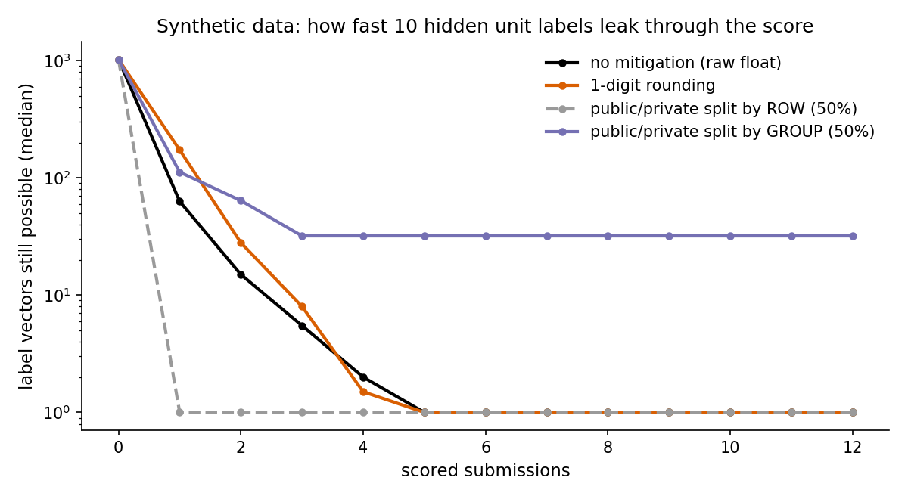

# Evaluation Feedback as an Information Channel

This is a synthetic, defender-oriented design note. It does not describe or
identify a deployed system. The executable example is
`vibration_anomaly_lab/metric_design.py`.

## A returned score reveals something about hidden labels

An evaluation procedure maps predictions and hidden labels to an observable
score. Repeated observations can narrow the label vectors consistent with
the responses. The feedback policy therefore belongs in evaluation design,
alongside whether the metric measures the intended decision.

The toy model enumerates small binary label spaces exactly. Its conclusions
are conditional on its prior, scoring rule, public/private split, precision,
submission budget and query strategy. It is not a general attack-complexity
estimate for large systems.

## Distinguish a realised reduction from expected information

For a uniform prior over candidate label vectors, a deterministic response
leaves a subset of those candidates. The demo reports

```text
realised bits resolved = log2(prior candidate count / surviving candidate count)
```

This is a reduction for the **observed response**. A rare response can shrink
the set sharply. If a query has at most m possible replies, `log2(m)` bounds
the **expected information**, not the realised reduction of every reply.
For adaptive queries the expected information adds conditionally along the
query history; a bound on each response alphabet yields a bound on total
expected information.

The API `leakage_bound_bits` returns that expected-information upper bound.
It is not a per-run ceiling for `bits_resolved`. Under a uniform finite prior,
the prior's total entropy is a pointwise bound, because at least one candidate
remains. Do not compare the expectation bound with a single lucky transcript
and infer an implementation error.

## The positive-count prior changes the problem

If exactly 2 of 10 labels are known to be positive, there are
`C(10, 2) = 45` possible truths. The uniform prior entropy is about 5.49 bits.
For a fixed query predicting k positives, unit F1 equals `2 TP / (k + 2)`.
That query has at most 3 possible outcomes, although the union over all
queries contains 15 distinct F1 values.

A decision tree with at most 3 branches per response needs depth at least
`ceil(log(45) / log(3)) = 4` to identify **every** possible truth. This is a
worst-case lower bound; some truths can be identified earlier. It is not a
claim that the repository constructs a strategy attaining the bound.

Without a published positive count, the demo starts from all `2**10 = 1024`
label vectors. Under that independent uniform-label prior, its default hidden
truth is identified after 3 adaptive submissions:

```text
submission   displayed F1   candidates left   realised bits resolved
1            0.222222       21                5.61
2            0.000000       6                 7.42
3            0.666667       1                 10.00
```

The display above rounds for readability. It is a single transcript for the
synthetic default truth, not an average over truths or a guaranteed budget.
The program also compares designs over a reproducible collection of hidden
truths; run the demo to see its full table.

## Public/private grouping depends on the prior

In the independent-label toy model, a private group never used for public
scoring retains its unobserved binary label: public replies cannot distinguish
its two states. With 5 private groups, this leaves `2**5 = 32` candidate
completions after the public labels are known.

If the total positive count is published, labels are no longer independent.
Learning the public labels also reveals how many positives remain in private.
In extreme cases that determines every private label. Correlated labels or
other side information can have the same effect. Group separation is useful,
but the independent-prior residual is not a universal privacy guarantee.

A split by rows of the same labelled group leaves that group's label involved
in public scoring. It does not provide the same isolation as a split by group.



*Figure 07. Remaining candidate label vectors in the stated toy prior.
Rounding and query limits change the observation channel; group separation
limits what public scoring can reveal under independent labels.*

## Design implications

- Limit and account for scored queries, including adaptive reuse.
- Examine attainable response values before choosing rounding. Coarse rounding
  can reduce distinctions, but repeated queries may still resolve the labels.
- Split public and private data by the dependency unit, and assess side
  information such as known label totals.
- Use a sealed evaluation set after selection. Its labels must not influence
  subsequent model or threshold choices if its score is to remain a clean test.
- Analyse randomised feedback under an explicit privacy and utility model.
  Adding noise or enlarging the dataset does not by itself establish privacy.
- Treat special returns, errors and sentinel values as part of the observable
  channel. They can carry information just as ordinary scores do.

No finite toy experiment proves an evaluation system safe. The intended result
is a review method: state the threat model, model the observable channel, and
measure the effect of proposed restrictions under explicit assumptions.

## Disclosure

For a real system, report the issue privately to its owner with enough detail
to reproduce and assess it. Include mitigation options and their costs. Avoid
using the finding for competitive advantage while reporting it. A public
write-up should explain the general principle using self-generated data and
omit a working recipe against an unresolved system. Keep the owner's system,
participants and private evaluation data out of the educational example.

## Sources of numbers

- Dataset dimensions and synthetic default truth: `data/make_synthetic_data.py`.
- Candidate counts and default transcript: `python -m vibration_anomaly_lab.metric_design`.
- Binomial counts, entropy and decision-tree lower bound: arithmetic shown above.
- Repeated toy comparisons: `scripts/make_figures.py` and `figures/07-leakage-candidates.png`.
